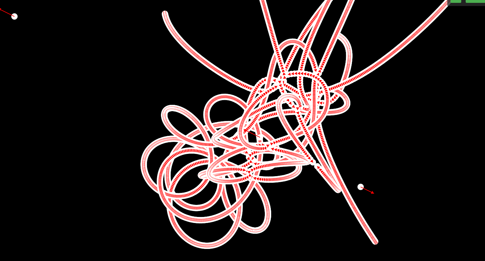

# Newer cmake is required

     you can get it here
    wget https://github.com/Kitware/CMake/releases/download/v3.31.5/cmake-3.31.5-linux-x86_64.tar.gz

Then buiild with 
     ../cmake-3.31.5-linux-x86_64/bin/cmake ..

The nbody porgram opens a websocket on localhost:1234 that the webpage html/index.html
Will connect to. It calculates this,

## N-Body simulation

The N-body gravitational problem begins with a set of
N particles with initial positions Pi = (xi , yi , zi) in three dimensional space, where i ∈ {1, 2, 3, ..., N }, moving with initial velocities Vi = (vix, viy, viz). Each of these particles are under the influence of a gravitational force Fi = (fix, fiy, fiz) due to their masses m i , according to Newton’s inverse-square law of gravitation. The component of the force in the x direction is given by:

fix = GΣj≠i ((mimj) / (d2(i,j))) ((xixj) / (d(i,j)))

where G is the gravitational constant and d is the distance between particles i and j. Similar components of force apply in the y and z directions. The acceleration on a particle, Ai = (aix, aiy, aiz), as a result of the force experienced in the x direction is given by:

aix = fix / mi

This results in a new velocity vix' after time δt:

vix' = vix + aix δt

The N-body simulation then continues for a predetermined time period T , integrating with δt discrete time steps. In order to achieve accurate results, the time intervals between each integration step must be short.

https://github.com/dileban/nbody-simulation

The Idea was to use P2300 https://github.com/NVIDIA/stdexec to perform the calculation,
but this is not done yet.